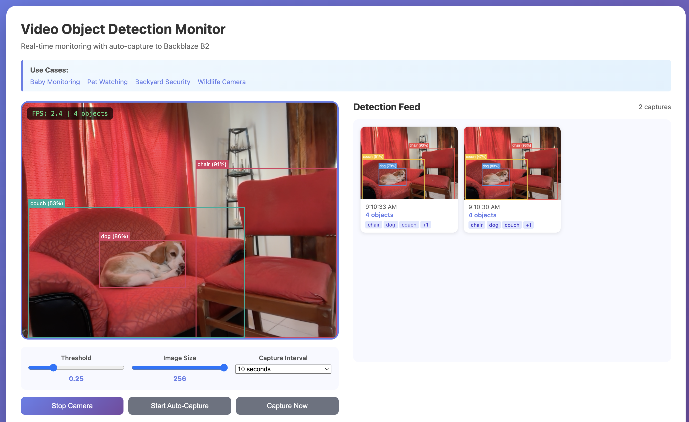

# Real-Time YOLOv9 Video Object Detection in the Browser with Transformers.js and Backblaze B2

A JavaScript example app that runs [YOLOv9](https://github.com/WongKinYiu/yolov9) real-time object detection on live webcam video entirely in the browser using [Transformers.js](https://huggingface.co/docs/transformers.js) and WebAssembly — no server GPU required. Detected snapshots and bounding box metadata are automatically captured and stored in [Backblaze B2](https://www.backblaze.com/cloud-storage?utm_source=github&utm_medium=referral&utm_campaign=ai_artifacts&utm_content=objectdetection) cloud storage.

Detect people, vehicles, animals, and 80 COCO object classes from your webcam in real time. Configure auto-capture intervals (5 seconds to 5 minutes) to continuously monitor a scene and save annotated snapshots with detection metadata (labels, confidence scores, bounding boxes) to S3-compatible Backblaze B2 object storage.



## Use Cases

- **Pet monitoring** — Watch your pets while you're away with automatic capture
- **Home and backyard security** — Detect people, vehicles, and animals in outdoor areas
- **Wildlife camera** — Capture and log wildlife activity with configurable intervals
- **Prototype and demo** — Build browser-based computer vision apps without provisioning GPU infrastructure

## Technologies

- **[Transformers.js](https://huggingface.co/docs/transformers.js)** — Run Hugging Face AI models like YOLOv9 in the browser with WebAssembly
- **[YOLOv9](https://github.com/WongKinYiu/yolov9)** — State-of-the-art real-time object detection model (COCO-trained, 80 classes)
- **[Backblaze B2](https://www.backblaze.com/cloud-storage?utm_source=github&utm_medium=referral&utm_campaign=ai_artifacts&utm_content=objectdetection)** — S3-compatible cloud object storage at $6/TB/month

## What This Demonstrates

- **Client-side object detection**: Run YOLOv9 entirely in the browser — no server GPU required
- **Auto-capture monitoring**: Configurable intervals (5s to 5min) for continuous scene monitoring
- **Live detection feed**: Real-time bounding box overlay with an animated grid of captured snapshots
- **Cost-effective cloud storage**: Store snapshots and detection JSON in Backblaze B2
- **Secure direct uploads**: Browser-to-cloud uploads using S3 pre-signed URLs

## Architecture

```
User Camera → Browser (Transformers.js + YOLOv9) → Real-time Detection
                                ↓
              Auto-Capture (configurable interval)
                                ↓
              Snapshot PNG → B2 Storage
              Detection JSON → B2 Storage
                                ↓
              Live Feed Grid (animated, clickable)
```

### Flow

1. User clicks "Start Camera" to enable webcam
2. Browser loads YOLOv9 model (Xenova/gelan-c_all)
3. Video frames are processed in real-time for object detection
4. User selects capture interval and clicks "Start Auto-Capture"
5. At each interval:
   - Snapshot is captured and uploaded to B2
   - Detection data (labels, bounding boxes, confidence) saved to B2
   - New capture animates into the detection feed grid
6. Click any feed item to view enlarged with B2 links

## Quick Start

### Prerequisites

- **Node.js 18+**
- **[Backblaze B2 Account](https://www.backblaze.com/cloud-storage?utm_source=github&utm_medium=referral&utm_campaign=ai_artifacts&utm_content=objectdetection)** (free tier available)
  - Create a bucket
  - Generate an Application Key with `readFiles`, `writeFiles`, `writeBuckets` permissions

### 1. Clone & Install

```bash
git clone https://github.com/backblaze-b2-samples/b2-transformers-video-object-detection.git
cd b2-transformers-video-object-detection/backend
npm install
```

### 2. Configure B2 Credentials

```bash
cp .env.example .env
```

Edit `.env` with your B2 credentials:

```env
B2_APPLICATION_KEY_ID=your_key_id_here
B2_APPLICATION_KEY=your_application_key_here
B2_BUCKET_NAME=your-bucket-name
B2_REGION=us-west-002
B2_PUBLIC_URL_BASE=https://f005.backblazeb2.com/file/your-bucket-name
```

> Get your B2 region from your bucket details page. Set `B2_PUBLIC_URL_BASE` to the bucket's public URL base, or a custom domain, for compatibility with Backblaze B2 sample standards; the app returns expiring pre-signed read URLs by default.

### 3. Start the App

```bash
npm start
```

**That's it!** The server automatically:
- Configures B2 CORS for browser uploads
- Serves both frontend and API
- Opens at `http://localhost:3000`

### 4. Use the App

1. Open **http://localhost:3000** in your browser
2. Click **"Start Camera"** and allow camera access
3. Adjust detection threshold and image size as needed
4. Select a capture interval (5s, 10s, 30s, 1min, 5min)
5. Click **"Start Auto-Capture"** to begin monitoring
6. Watch the Detection Feed populate with snapshots
7. Click any feed item to view details and B2 links

> First run downloads the YOLOv9 model (~50MB) - this may take a minute

## Manual CORS Setup

If auto-setup fails (missing permissions), run manually:

```bash
npm run setup-cors
```

**Required B2 Key Permissions**:
- `listBuckets`
- `readFiles`
- `writeFiles`
- `writeBucketSettings` (required for CORS setup)

## Usage

1. Open the frontend in your browser
2. Click "Start Camera" to enable webcam
3. Objects are detected in real-time and shown with bounding boxes
4. Adjust controls:
   - **Threshold**: Minimum confidence score (0.01 - 1.0)
   - **Image Size**: Processing resolution (64 - 256)
   - **Capture Interval**: Time between auto-captures (5s - 5min)
5. Click "Start Auto-Capture" to begin continuous monitoring
6. The Detection Feed shows captured snapshots with:
   - Timestamp
   - Number of objects detected
   - Object labels (person, dog, car, etc.)
7. Click any feed item to enlarge and access B2 storage links
8. Use "Capture Now" for manual one-off snapshots

## Deployment

### Deploy Backend

**Railway / Render / Fly.io**:
- Set environment variables from `.env`
- Deploy `backend/` directory
- Update frontend `apiUrl` to deployed URL

**Docker**:
```bash
docker-compose up -d
```

### Deploy Frontend

**Static Hosting** (Netlify, Vercel, Cloudflare Pages):
- Deploy `frontend/` directory
- Set API URL in settings or hardcode in `index.html`

**B2 Static Hosting**:
- Upload `frontend/index.html` to B2 bucket
- Enable website hosting on bucket
- Access via B2 website URL

## API Endpoints

### POST /api/presign-snapshot

Request:
```json
{
  "contentType": "image/png"
}
```

Response:
```json
{
  "uploadUrl": "https://...",
  "publicUrl": "https://...",
  "key": "snapshots/uuid.png",
  "fileId": "uuid"
}
```

`publicUrl` is an expiring pre-signed read URL.

### POST /api/presign-detections

Request:
```json
{
  "fileId": "uuid"
}
```

Response:
```json
{
  "uploadUrl": "https://...",
  "publicUrl": "https://...",
  "key": "detections/uuid.json"
}
```

`publicUrl` is an expiring pre-signed read URL.

## Technical Details

### Object Detection Model

This example uses [Xenova/gelan-c_all](https://huggingface.co/Xenova/gelan-c_all), a YOLOv9-based object detection model quantized for browser inference via Transformers.js and WebAssembly. It detects 80 COCO object classes (person, car, dog, cat, bicycle, bird, etc.) with real-time bounding boxes and confidence scores.

- **Model**: [Xenova/gelan-c_all](https://huggingface.co/Xenova/gelan-c_all) — YOLOv9-based, COCO-trained
- **Library**: [Transformers.js](https://huggingface.co/docs/transformers.js) — Run Hugging Face transformer models in the browser
- **Size**: ~50MB download (cached in browser after first load)
- **Classes**: 80 COCO classes — person, car, dog, cat, truck, bicycle, bird, and more
- **Output**: Bounding boxes, class labels, and confidence scores per frame

### Storage

- **Provider**: [Backblaze B2](https://www.backblaze.com/cloud-storage?utm_source=github&utm_medium=referral&utm_campaign=ai_artifacts&utm_content=objectdetection)
- **API**: S3-compatible API with pre-signed URLs
- **Pricing**: $6/TB/month storage, uploads are FREE
- **Stored data**: Annotated PNG snapshots + JSON detection metadata (labels, bounding boxes, confidence)

### Browser Compatibility

- Chrome 90+
- Edge 90+
- Firefox 90+
- Safari 15.4+

Requires WebAssembly, ES6 modules, and getUserMedia support.

## Limitations

- First run loads model (~50MB, one-time download)
- Higher image sizes increase accuracy but reduce FPS
- Requires camera permissions
- Browser must stay open during detection

## Potential Improvements

- [ ] Motion-triggered capture (only capture when objects detected)
- [ ] Alert notifications when specific objects detected (e.g., person)
- [ ] Video file upload (not just webcam)
- [ ] Record video clips with detections overlay
- [ ] Multiple model options (faster/slower)
- [ ] Object tracking across frames
- [ ] Export feed history to CSV/JSON
- [ ] Filter feed by detected object type

## Related Resources

- **[Transformers.js Documentation](https://huggingface.co/docs/transformers.js)** — Run Hugging Face AI models in the browser with WebAssembly
- **[Transformers.js GitHub](https://github.com/huggingface/transformers.js)** — Source code and examples
- **[YOLOv9 Paper](https://arxiv.org/abs/2402.13616)** — Original research: "YOLOv9: Learning What You Want to Learn Using Programmable Gradient Information"
- **[COCO Dataset](https://cocodataset.org/)** — Common Objects in Context — the 80-class dataset YOLOv9 is trained on
- **[Backblaze B2 Documentation](https://www.backblaze.com/docs/cloud-storage?utm_source=github&utm_medium=referral&utm_campaign=ai_artifacts&utm_content=objectdetection)** — Cloud storage API docs
- **[B2 S3-Compatible API](https://www.backblaze.com/docs/cloud-storage-s3-compatible-api?utm_source=github&utm_medium=referral&utm_campaign=ai_artifacts&utm_content=objectdetection)** — Use standard S3 SDKs with Backblaze B2

## Troubleshooting

### CORS Error: "Access to fetch has been blocked by CORS policy"

**Problem**: Browser shows CORS error when uploading snapshot.

**Solution**:
1. Run `npm run setup-cors` in the backend directory
2. Or manually configure CORS on your B2 bucket
3. Verify CORS is set: Go to B2 Console > Your Bucket > Settings > CORS Rules

### Camera Access Denied

**Problem**: Browser won't access camera.

**Solution**:
1. Click the camera icon in your browser's address bar
2. Allow camera permissions for localhost
3. Ensure no other application is using the camera
4. Try a different browser

### Model Loading Failed

**Problem**: "Error loading model" message.

**Solution**:
1. Check internet connection (model downloads from Hugging Face)
2. Clear browser cache and reload
3. Try incognito/private mode
4. Check browser console for specific errors

### Low FPS / Slow Detection

**Problem**: Detection is laggy or slow.

**Solution**:
1. Reduce "Image Size" slider (try 64 or 96)
2. Reduce "Video Scale" slider (try 0.25 or 0.3)
3. Close other browser tabs/applications
4. Use Chrome for best WebAssembly performance

## License

This project is licensed under the MIT License. See the [LICENSE](LICENSE) file for details.
